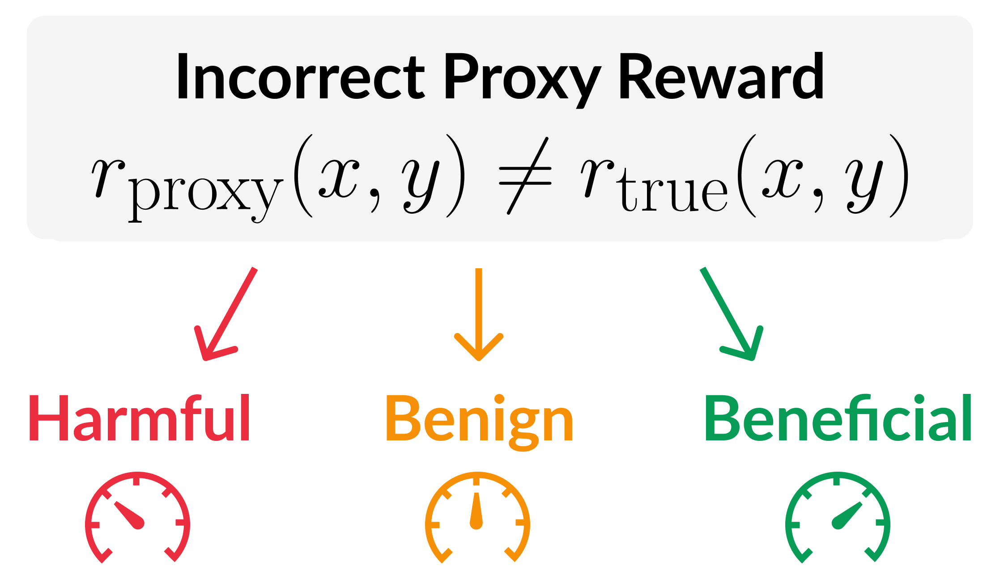

# When Errors Can Be Beneficial: A Categorization of Imperfect Rewards for Policy Gradient

[[Paper](https://arxiv.org/abs/2604.25872)]

Official implementation based on the [PyTorch](https://pytorch.org/), [Hugging Face TRL](https://huggingface.co/docs/trl/en/index), [open-instruct](https://github.com/allenai/open-instruct), [AlpacaEval](https://github.com/tatsu-lab/alpaca_eval) and [IFBench](https://github.com/allenai/IFBench) libraries.

<br>
<p align="center">
  
</p>

## Table of Contents
- [Installation](#installation)
- [Controlled experiments (Section 3.3)](#controlled-experiments-section-33)
  - [Beneficial Errors That Prevent Attraction to Mediocre Outputs, Using Exact Gradient Policy Gradient](#beneficial-errors-that-prevent-attraction-to-mediocre-outputs-using-exact-gradient-policy-gradient)
  - [Additional Settings (Appendix C)](#additional-settings-appendix-c)
- [Application I: Harm-Aware Accuracy for Reward Model Evaluation (Section 4)](#application-i-harm-aware-accuracy-for-reward-model-evaluation-section-4)
  - [Relabeling, Filtering and Splitting UltraFeedback Using a Ground Truth Reward Model](#relabeling-filtering-and-splitting-ultrafeedback-using-a-ground-truth-reward-model)
  - [Initial Policy and Reward Model Evaluation](#initial-policy-and-reward-model-evaluation)
  - [Policy Gradient](#policy-gradient)
  - [Additional Settings (Appendix C.2)](#additional-settings-appendix-c2)
- [Application II: When Should Partially Correct Outputs Be Rewarded? (Section 5)](#application-ii-when-should-partially-correct-outputs-be-rewarded-section-5)
  - [UltraFeedback dataset coupled with pairs of IFBench constraints](#ultrafeedback-dataset-coupled-with-pairs-of-ifbench-constraints)
  - [Initial Probability of Success Evaluation](#initial-probability-of-success-evaluation)
  - [Policy Gradient](#policy-gradient-1)
  - [Additional Policy Gradient Settings (Appendix C.3)](#additional-policy-gradient-settings-appendix-c3)

## Installation

This repository uses two separate conda environments:

| Folder | Conda environment
|---|---
| `imperfect_rewards/` | Controlled Experiments + Application I
| `open-instruct/` and `IFBench/` | Application II |

<details>
<summary><strong>Installation for Controlled Experiments And Application I</strong></summary>


1. cd into `imperfect_rewards/`.
2. Create and activate a virtual environment. For example, using Conda: \
```conda create -n imperfect_rewards_1 python=3.12 && conda activate imperfect_rewards_1```.
3. Install PyTorch (see this [link](https://pytorch.org/get-started/locally/#start-locally) for best practices). Our experiments used PyTorch 2.6.0 with the CUDA 11.8 wheel build.
4. Run 
```bash 
cd imperfect_rewards
pip install .
```
</details>

<details>
<summary><strong>Installation for IFBench And Application II</strong></summary>

1. cd into `open-instruct/`.
2. Create and activate a virtual environment. For example, using Conda: \
```conda create -n imperfect_rewards_2 python=3.11 && conda activate imperfect_rewards_2```.
3. Install PyTorch : \
```pip install "torch==2.9.0" --index-url https://download.pytorch.org/whl/cu129```
4. Install the other dependencies: \
```pip install -r requirements.txt```
5. Install the open-instruct package itself: \
```pip install -e . --no-deps```
6. Install FlashAttention: \
```pip install flash-attn --no-build-isolation```
7. Install the nltk resources within `open-instruct/`
```bash
cd open-instruct
python -c "
import nltk
from pathlib import Path
nltk_dir = Path('open_instruct/IFEval/.nltk_data')
nltk_dir.mkdir(exist_ok=True)
for resource in ['punkt', 'punkt_tab', 'stopwords', 'averaged_perceptron_tagger_eng']:
    nltk.download(resource, download_dir=str(nltk_dir))
"
```
8. Install the nltk resources within `IFBench/`
```bash
cd IFBench
python -c "
import nltk
from pathlib import Path
nltk_dir = Path('.nltk_data')
nltk_dir.mkdir(exist_ok=True)
for resource in ['punkt', 'punkt_tab', 'stopwords', 'averaged_perceptron_tagger_eng']:
    nltk.download(resource, download_dir=str(nltk_dir))
"
``` 
If you don't want to download it twice, you could add the NLTK data path within the [build_ultrafeedback_ifbench.py](IFBench/build_ultrafeedback_ifbench.py)

</details>


## Controlled experiments (Section 3.3)

> All commands in this section are run from inside `imperfect_rewards/`.

These experiments train linear softmax policies via policy gradient on a synthetic problem (5 outputs, 5-dimensional feature vectors) to empirically verify the paper's theoretical results. Each experiment runs on CPU.

The entry point for all experiments below is `loglin_pg_experiments_plan_runner.py`. Configuration files for each figure are in `controlled_loglin_pg/experiments_plans/` and the problem instances (initial policy, rewards, features) are in `controlled_loglin_pg/configs/`.

### Beneficial Errors That Prevent Attraction to Mediocre Outputs, Using Exact Gradient Policy Gradient

Runs policy gradient with exact gradients across three initial probabilities of y* (0.05, 0.10, 0.15), training with either the ground truth reward or a proxy reward model. Results are saved under `outputs/pg_loglin_ystar_prob/`.

<details>
<summary><strong>Command (CPU):</strong></summary>

```sh
python loglin_pg_experiments_plan_runner.py --plan_config_path controlled_loglin_pg/experiments_plans/loglin_pg_gt_reward_not_best_experiments_plan.json
```
</details>

### Additional Settings (Appendix C)

<details>
<summary><strong>Beneficial Errors That Prevent Attraction to Mediocre Outputs, Using Sample-Based Gradients</strong></summary>

  Runs the same six experiments as above but using sample-based gradient estimates (REINFORCE). Results are saved under `outputs/pg_loglin_ystar_prob_reinforce/`.

  <details>
  <summary><strong>Command (CPU):</strong></summary>

  ```sh
  python loglin_pg_experiments_plan_runner.py --plan_config_path controlled_loglin_pg/experiments_plans/loglin_pg_gt_reward_not_best_reinforce_experiments_plan.json
  ```
  </details>
</details>

<details>
<summary><strong>Feature Similarity Between y* and y_med</strong></summary>

Runs three experiments varying the inner product ⟨ $\phi$(y*), $\phi$(y_med) ⟩ (negative, zero, positive). Results are saved under `outputs/synth_pg_features_sim/`.

  <details>
  <summary><strong>Command (CPU):</strong></summary>

  ```sh
  python loglin_pg_experiments_plan_runner.py --plan_config_path controlled_loglin_pg/experiments_plans/features_sim_experiments_plan.json
  ```
  </details>
</details>

## Application I: Harm-Aware Accuracy for Reward Model Evaluation (Section 4)

> All commands in this section are run from inside `imperfect_rewards/`.

### Relabeling, Filtering and Splitting UltraFeedback Using a Ground Truth Reward Model

We start from the binarized version of [UltraFeedback](https://huggingface.co/datasets/HuggingFaceH4/ultrafeedback_binarized) and filter out examples where the prompt or one of the outputs exceeds 512 tokens. We then select a subset of 10,000 examples from the training split (`train_prefs`), relabel output preferences in both the selected training subset and the test split (`test_prefs`) using a ground truth reward model, and discard examples where both outputs share the same ground truth reward. In the main experiments (Section 4), we use [ArmoRM-Llama3-8B-v0.1](https://huggingface.co/RLHFlow/ArmoRM-Llama3-8B-v0.1) as the ground truth reward model.

<details>
<summary><strong>Command for creating the UltraFeedback-based dataset (1 GPU):</strong></summary>

```sh
python src/main_data.py --config src/configs/pref_data/uf_pref_data_relabel_config.yaml
```
The generated dataset will be saved under the directory specified in the configuration file. Default: `data_files/uf_armorm_relabeled`.
</details>

### Initial Policy and Reward Model Evaluation

We evaluate the proxy reward models for a given initial policy using [this configuration file](imperfect_rewards/src/configs/rm_eval/rm_eval_config.yaml). Note that the accuracy metrics (Acc, Acc-W, HAcc, HAcc-W) used in the paper have been implemented [here](imperfect_rewards/src/imperfect_rewards/metrics/accuracy.py). 
This step:
- Computes and saves log-probabilities over preferences in the dataset created in the [previous step](#relabeling-filtering-and-splitting-ultrafeedback-using-a-ground-truth-reward-model).
- Retrieves and saves per-prompt reward metrics for the offline responses in the dataset (precomputed during dataset generation)
- Generates on-policy responses and saves their associated log-probabilities
- Computes ground truth rewards and accuracy measures for the on-policy dataset
- Computes rewards for all proxy reward models

Before running, make sure to:
- Set `dataset_paths` to the path of the dataset generated in the [previous step](#relabeling-filtering-and-splitting-ultrafeedback-using-a-ground-truth-reward-model).
- Set `language_model_path` to the policy you want to evaluate (and later train).
- Set `output_dir_base` to the directory where you want to save the evaluation results.

<details>
<summary><strong>Command for reward model evaluation (1 GPU):</strong></summary>

```sh
python src/main.py --config src/configs/rm_eval/rm_eval_config.yaml
```
</details>

### Policy Gradient

For running policy gradient (RLOO by default), use [these configuration files](./imperfect_rewards/src/configs/pg/).

Before running, make sure to:
- Set `dataset_path` to the relabeled UltraFeedback dataset generated in [the data preparation step](#relabeling-filtering-and-splitting-ultrafeedback-using-a-ground-truth-reward-model).
- Set `reward_model_path` to the desired proxy reward model.

<details>
<summary><strong>Command for OLMo-2-1B-SFT (2 GPUs):</strong></summary>

```sh
accelerate launch --num_processes 2 --num_machines 1 --config_file src/accelerate_configs/deepspeed3.yaml src/main.py --config src/configs/pg/olmo_1B_sft_rloo_config.yaml
```
TensorBoard logs and checkpoints will be saved under the directory specified in the configuration file. Default: `outputs/rloo_open_rms/olmo1B`.
</details>

<details>
<summary><strong>Command for Llama-3.2-1B-Instruct (2 GPUs):</strong></summary>

```sh
accelerate launch --num_processes 2 --num_machines 1 --config_file src/accelerate_configs/deepspeed3.yaml src/main.py --config src/configs/pg/llama_1B_instruct_rloo_config.yaml
```
TensorBoard logs and checkpoints will be saved under the directory specified in the configuration file. Default: `outputs/rloo_open_rms/llama1B`.
</details>

<details>
<summary><strong>Command for Llama-3.2-3B-Instruct (4 GPUs):</strong></summary>

```sh
accelerate launch --num_processes 4 --num_machines 1 --config_file src/accelerate_configs/deepspeed3.yaml src/main.py --config src/configs/pg/llama_3B_instruct_rloo_config.yaml
```
TensorBoard logs and checkpoints will be saved under the directory specified in the configuration file. Default: `outputs/rloo_open_rms/llama3B`.
</details>

<details>
<summary><strong>Command for Qwen3-1.7B-Base (4 GPUs):</strong></summary>

```sh
accelerate launch --num_processes 4 --num_machines 1 --config_file src/accelerate_configs/deepspeed3.yaml src/main.py --config src/configs/pg/qwen_1p7B_base_rloo_config.yaml
```
TensorBoard logs and checkpoints will be saved under the directory specified in the configuration file. Default: `outputs/rloo_open_rms/qwen1p7B`.
</details>

### Additional Settings (Appendix C.2)

<details>
  <summary><strong>One-Vs-Many Accuracy Metrics on RewardBench2</strong></summary>
  
  In this section, we will use [RewardBench2](https://huggingface.co/datasets/allenai/reward-bench-2) dataset.

  <details>
  <summary><strong>Step 1: Reformat test split of RewardBench2 into conversational format</strong></summary>

  We want to select only one pair of chosen/rejected per prompt and filter any ties.
  
  ```sh
  python src/imperfect_rewards/data/rewardbench2_pairwise_reformatting.py \
    --output_path FILL_YOUR_OUTPUT_PATH \
    --split test
  ```
  - The resulting dataset will be saved in ```FILL_YOUR_OUTPUT_PATH```. Default is ```data_files/rewardbench_2_one_vs_many_reformatted```.
  </details>

  <details>
  <summary><strong>Step 2: Relabel and Filter RewardBench2 using a Ground Truth Reward Model</strong></summary>

  ```sh
  python src/main_data.py --config src/configs/pref_data/rewardbench2_one_vs_many_pref_data_config.yaml
  ```
  - The generated dataset will be saved under the directory specified in the configuration file. Default: `data_files/rewardbench2_armorm_relabeled`.
  </details>

  <details>
  <summary><strong>Step 3: Run Reward Model Evaluation</strong></summary>

  Follow the instructions provided [earlier](#initial-policy-and-reward-model-evaluation). Make sure to use the correct dataset, i.e. the one created above in Step 2.
  </details>
</details>

<details>
<summary><strong>Experiments Using WildChat-IF Dataset</strong></summary>

  In this section, we will use [WildChat-IF](https://huggingface.co/datasets/allenai/tulu-3-wildchat-if-on-policy-8b) dataset.

  <details>
  <summary><strong>Step 1:  Relabeling, Filtering and Splitting the WildChat-based dataset:</strong></summary>

  ```sh
  python src/main_data.py --config src/configs/pref_data/wildchat_if_pref_data_relabel_config.yaml
  ```
  The generated dataset will be saved under the directory specified in the configuration file. Default: `data_files/wildchat_if_pref_armorm_relabeled`.
  </details>

  <details>
  <summary><strong>Step 2: Initial Policy and Reward Model Evaluation:</strong></summary>

  Make sure to fill in the path to the dataset created in Step 1 in `dataset_paths` of the config file.

  ```sh
  python src/main.py --config src/configs/rm_eval/rm_eval_config.yaml
  ```
  </details>

  <details>
  <summary><strong>Step 3: Policy Gradient:</strong></summary>

  Refer to the [Policy Gradient section](#policy-gradient). Make sure to use the dataset created in Step 1 in `dataset_paths` of the config file.
  </details>

</details>

<details>
  <summary><strong>Experiments Using Another Ground Truth</strong></summary>

  In this set of experiments, we use `Skywork/Skywork-Reward-V2-Llama-3.1-8B` as ground truth reward model.

  <details>
  <summary><strong>Step 1:  Relabeling, Filtering and Splitting the UltraFeedback dataset:</strong></summary>

  ```sh
  python src/main_data.py --config src/configs/pref_data/uf_pref_data_relabel_skywork_gt_config.yaml
  ```
  The generated dataset will be saved under the directory specified in the configuration file. Default: `data_files/uf_skywork_relabeled`.
  </details>

  <details>
  <summary><strong>Step 2: Initial Policy and Reward Model Evaluation:</strong></summary>

  ```sh
  python src/main_data.py --config src/configs/rm_eval/rm_eval_skywork_gt_config.yaml
  ```
  </details>

  <details>
  <summary><strong>Step 3: Policy Gradient:</strong></summary>

  Refer to the [Policy Gradient section](#policy-gradient). The config files are located [here](imperfect_rewards/src/configs/pg/skywork_gt). 

  Example to run policy gradient using Llama-3.2-3B-Instruct:
  ```sh
  accelerate launch --num_processes 4 --num_machines 1 --config_file src/accelerate_configs/deepspeed3.yaml src/main.py --config src/configs/pg/skywork_gt/llama_3B_instruct_rloo_config.yaml
  ```
  TensorBoard logs and checkpoints will be saved under the directory specified in the configuration file. Default: `outputs/rloo_open_rms/llama3B`.
  </details>

</details>

<details>
  <summary><strong>Evaluating Language Model Performance Through Win-Rate Against the Initial Language Model</strong></summary>

  We use [AlpacaEval](https://github.com/tatsu-lab/alpaca_eval) to evaluate policy-gradient-trained models against the initial language model via win-rate. Make sure to set your OpenAI API key in [this config file](imperfect_rewards/src/configs/alpaca_eval/openai_config/config.yaml) under the `api_key` field.

  <details>
  <summary><strong>Step 1: Prepare the baseline JSON (initial model outputs)</strong></summary>

  This step creates a JSON file from the initial RM evaluation results to serve as the reference baseline. `path_to_prompts` and `path_to_generations` are the prompt and response `.pt` files located inside the output folder from the RM evaluation step.

  ```sh
  python src/imperfect_rewards/recipes/alpacaeval/alpaca_eval_formatting.py \
    --path_to_prompts PATH_TO_PROMPTS.pt \
    --path_to_generations PATH_TO_INITIAL_RESPONSES.pt \
    --random_seed 42
  ```
  </details>

  <details>
  <summary><strong>Step 2: Create JSON files from the policy gradient output directory</strong></summary>

  This step creates JSON files for each checkpoint in the policy gradient output directory, pairing generations with the corresponding prompts. `path_to_prompts` is the same path as in Step 1; `path_to_generations` is the directory containing the policy gradient experiments.

  ```sh
  python src/imperfect_rewards/recipes/alpacaeval/alpaca_eval_formatting.py \
    --path_to_prompts PATH_TO_PROMPTS.pt \
    --path_to_generations PATH_TO_PG_DIR \
    --random_seed 42 \
    --use_train_pg
  ```
  </details>

  <details>
  <summary><strong>Step 3: Launch AlpacaEval</strong></summary>

  This step runs AlpacaEval comparing model outputs against the baseline; we use `--steps 2452` to restrict evaluation to the last checkpoint. `reference_outputs` is the JSON created in Step 1.

  ```sh
  nohup python src/imperfect_rewards/recipes/alpacaeval/alpaca_eval_script.py \
    --model_outputs PATH_TO_PG_DIR \
    --steps 2452 \
    --reference_outputs PATH_TO_BASELINE.json \
    > alpaca_eval.txt 2>&1 &
  ```
  </details>
</details>


## Application II: When Should Partially Correct Outputs Be Rewarded? (Section 5)

### UltraFeedback dataset coupled with pairs of IFBench constraints

> All commands in this section are run from inside `IFBench/`.

To later perform policy gradient mentioned in the Section 5 and Appendix C.3, we create a dataset that uses [IFBench](IFBench/) to append pairs of constraints to prompts from [`HuggingFaceH4/ultrafeedback_binarized`](https://huggingface.co/datasets/HuggingFaceH4/ultrafeedback_binarized). With `--create_pairs`, each unique constraint pair gets its own output subdirectory. Run from inside `IFBench/`. Use `out_dir` to give the desired output path.

<details>
<summary><strong>Command (train split):</strong></summary>

```sh
python build_ultrafeedback_ifbench.py \
  --dataset_name HuggingFaceH4/ultrafeedback_binarized \
  --out_dir YOUR_OUTPUT_DATA_DIR \
  --split_to_use train_prefs \
  --seed 42 \
  --max_examples 6000 \
  --max_prompt_length 512 \
  --tokenizer_name meta-llama/Llama-3.2-1B-Instruct \
  --allowlist json_overrides/pool/ifbench.json \
  --instruction_overrides json_overrides/pool_override/pool.json \
  --create_pairs
```
</details>

<details>
<summary><strong>Command (test split):</strong></summary>

```sh
python build_ultrafeedback_ifbench.py \
  --dataset_name HuggingFaceH4/ultrafeedback_binarized \
  --out_dir YOUR_OUTPUT_DATA_DIR \
  --split_to_use test_prefs \
  --seed 42 \
  --max_examples 6000 \
  --max_prompt_length 512 \
  --tokenizer_name meta-llama/Llama-3.2-1B-Instruct \
  --allowlist json_overrides/pool/ifbench.json \
  --instruction_overrides json_overrides/pool_override/pool.json \
  --create_pairs
```
</details>

### Initial Probability of Success Evaluation

> All commands in this section are run from inside `open-instruct/`.

To compute the initial probability of success, run the command below. Make sure to replace ```IFBench_constraint1``` and ```IFBench_constraint2```by the constraints you want to use, e.g. ```words:start_verb``` and ```words:alphabet```
<details>
<summary><strong>Command for computing the Initial Probability of Success of a pair of IFBench constraints using Qwen1.7B</strong></summary>

```sh
bash open-instruct/scripts_imperfect_rewards/qwen3-1.7B/initial_proba_success/get_initial_proba_success.sh "IFBench_constraint1;IFBench_constraint2"
```
- The resulting outputs will be saved under the directory specified in the bash script. Default is: ```"pg_vr/qwen_1p7B/${PAIR_SLUG}/${RUN_DATE}/binary_credit/"```.
</details>

### Policy Gradient

> All commands in this section are run from inside `open-instruct/`.

For running policy gradient, use [the bash scripts](open-instruct/scripts_imperfect_rewards) under the ```pg/``` folder. Make sure to:
- replace ```<YOUR_OUTPUT_DATA_DIR>``` in the bash scripts by the one you used in the [previous dataset creation step](#ultrafeedback-dataset-coupled-with-pairs-of-ifbench-constraints).
- replace ```IFBench_constraint1``` and ```IFBench_constraint2```in the below commands by the constraints you want to use, e.g. ```words:start_verb``` and ```words:alphabet```. You can get the exact constraints name used in the experiments by looking at ```Table 16``` in the paper.

<details>
<summary><strong>Command for running policy gradient with binary credit using Qwen3-1.7B (2 GPUs):</strong></summary>


```sh
bash open-instruct/scripts_imperfect_rewards/qwen3-1.7B/pg/2_gpus_binary_credit.sh "IFBench_constraint1;IFBench_constraint2"
```
- The resulting outputs (TensorBoard logs, checkpoints if enabled, etc.) will be saved under the directory specified in the bash script. Default is: ```pg_vr/qwen_1p7B/${PAIR_SLUG}/${RUN_DATE}/binary_credit/```.
</details>

<details>
<summary><strong>Command for running policy gradient with partial credit using Qwen3-1.7B (2 GPUs):</strong></summary>


```sh
bash open-instruct/scripts_imperfect_rewards/qwen3-1.7B/pg/2_gpus_partial_credit.sh "IFBench_constraint1;IFBench_constraint2"
```
- The resulting outputs (TensorBoard logs, checkpoints if enabled, etc.) will be saved under the directory specified in the bash script. Default is: ```pg_vr/qwen_1p7B/${PAIR_SLUG}/${RUN_DATE}/partial_credit/```.
</details>


### Additional Policy Gradient Settings (Appendix C.3)

<details>
<summary><strong>Command for running policy gradient with binary credit using Llama-3.2-3B Instruct (2 GPUs):</strong></summary>


```sh
bash open-instruct/scripts_imperfect_rewards/llama-3.2-3B-Instruct/pg/2_gpus_binary_credit.sh "IFBench_constraint1;IFBench_constraint2"
```
- The resulting outputs (TensorBoard logs, checkpoints if enabled, etc.) will be saved under the directory specified in the bash script. Default is: ```pg_vr/llama3B_instruct/${PAIR_SLUG}/${RUN_DATE}/binary_credit/```.
</details>

<details>
<summary><strong>Command for running policy gradient with partial credit using Llama-3.2-3B Instruct (2 GPUs):</strong></summary>


```sh
bash open-instruct/scripts_imperfect_rewards/llama-3.2-3B-Instruct/pg/2_gpus_partial_credit.sh "IFBench_constraint1;IFBench_constraint2"
```
- The resulting outputs (TensorBoard logs, checkpoints if enabled, etc.) will be saved under the directory specified in the bash script. Default is: ```pg_vr/llama3B_instruct/${PAIR_SLUG}/${RUN_DATE}/partial_credit/```.
</details>

<details>
<summary><strong>Command for running policy gradient with binary credit using OLMo-2-1B-Instruct (2 GPUs):</strong></summary>


```sh
bash open-instruct/scripts_imperfect_rewards/olmo1B-instruct/pg/2_gpus_binary_credit.sh "IFBench_constraint1;IFBench_constraint2"
```
- The resulting outputs (TensorBoard logs, checkpoints if enabled, etc.) will be saved under the directory specified in the bash script. Default is: ```pg_vr/olmo_1B_instruct/${PAIR_SLUG}/${RUN_DATE}/binary_credit/```.
</details>

<details>
<summary><strong>Command for running policy gradient with partial credit using OLMo-2-1B-Instruct (2 GPUs):</strong></summary>


```sh
bash open-instruct/scripts_imperfect_rewards/olmo1B-instruct/pg/2_gpus_partial_credit.sh "IFBench_constraint1;IFBench_constraint2"
```
- The resulting outputs (TensorBoard logs, checkpoints if enabled, etc.) will be saved under the directory specified in the bash script. Default is: ```pg_vr/olmo_1B_instruct/${PAIR_SLUG}/${RUN_DATE}/partial_credit/```.
</details>


## Citation
For citing the paper you can use:
```bibtex
@article{shang2026when,
  title   = {When Errors Can Be Beneficial: A Categorization of Imperfect Rewards for Policy Gradient},
  author  = {Shang, Shuning and Strauss, Hubert and Wei, Stanley and Arora, Sanjeev and Razin, Noam},
  journal = {arXiv preprint arXiv:2604.25872},
  year    = {2026}
}
```
